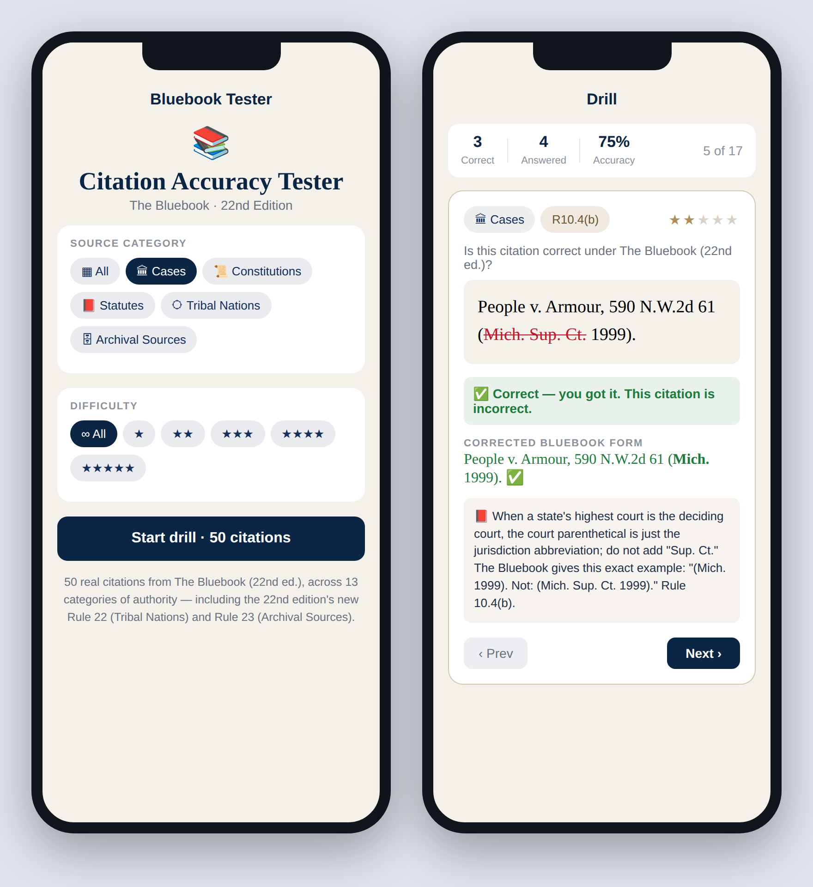

# Bluebook Citation Accuracy Tester — iOS app

A native **SwiftUI** iPhone/iPad app that drills citation accuracy under
**The Bluebook: A Uniform System of Citation (22nd ed.)**. It is the iOS version
of the web tester in this repository, rebuilt as a real Xcode project and
**grounded in the supplied text of the 22nd edition** — every correct form and
every "Not:" (incorrect) counter-example is taken from the Bluebook's own rule
illustrations.



## What it does

- Presents one real citation at a time and asks **"Correct or has an error?"**
- On reveal, the **incorrect portion is shown in red** (struck through), the
  **corrected Bluebook form** appears in green, and a **✅** marks citations that
  were already correct.
- Each card cites the **governing rule** (e.g., Rule 10.4(b), T13).
- Filter by **source category** and by **difficulty (1–5 stars)**; a live
  scoreboard tracks accuracy.

## Coverage — 50 citations across 13 categories of authority

| Category | Rule | Category | Rule |
| --- | --- | --- | --- |
| Cases | R10 | Internet & Electronic | R18 |
| Constitutions | R11 | Court Documents | Bluepages B17 |
| Statutes | R12 | Foreign Materials | R20 |
| Legislative Materials | R13 | International Materials | R21 |
| Administrative & Regulatory | R14 | **Tribal Nations** | **R22 (new in 22nd ed.)** |
| Books & Treatises | R15 | **Archival Sources** | **R23 (new in 22nd ed.)** |
| Periodicals | R16 | | |

Examples are taken verbatim from the 22nd edition — e.g.
*People v. Armour*, 590 N.W.2d 61 (Mich. 1999) **Not:** (Mich. Sup. Ct. 1999);
*City of Arlington v. FCC* **Not:** *City of Arlington, Texas v. FCC*;
Cal. Veh. Code § 11509 (West 2000) **Not:** (Cal. 2000); and the new Rule 22
Tribal materials such as *Const. of the Comanche Nation* art. II, § 1.

## Build & run

Requirements: **Xcode 16** or later, iOS **17.0+** deployment target.

```bash
open ios/BluebookCiteTester/BluebookCiteTester.xcodeproj
```

Then choose an iPhone simulator (or your device) and press **▶ Run**. No
third‑party dependencies — pure SwiftUI. The project uses Xcode's synchronized
file groups, so all source files in `BluebookCiteTester/` are picked up
automatically.

## Project structure

```
BluebookCiteTester/
├── BluebookCiteTester.xcodeproj
└── BluebookCiteTester/
    ├── BluebookCiteTesterApp.swift   App entry point
    ├── Models.swift                  Citation / segment / category types
    ├── CitationBank.swift            The 50-citation bank (grounded in the PDF)
    ├── QuizViewModel.swift           Deck, scoring, reveal state
    ├── CitationText.swift            Renders red-strikethrough errors + corrected form
    ├── Theme.swift                   Colors + star/chip helpers
    ├── HomeView.swift                Category & difficulty pickers
    ├── QuizView.swift                The drill card + feedback
    └── Assets.xcassets               App icon & accent color
```

> **Educational tool.** Citation forms reflect the supplied text of The Bluebook
> (22nd ed.). Always confirm against the current printed Bluebook for graded or
> filed work, as local court rules and editorial updates may govern.
